# Documentación Técnica — VPN Site-to-Site IPSec IKEv1 con Túnel GRE

**Estudiante:** Junior Javier Santos Perez
**Matrícula:** 2024-1599

---

## 1. Objetivo

El objetivo de esta práctica es configurar una **VPN Site-to-Site punto a punto con túnel GRE protegido por IPSec IKEv1**, que permita la comunicación cifrada entre las redes LAN de dos sitios remotos (R2 y R3) a través de una red pública simulada por R1.

A diferencia de un enfoque puramente route-based con IKEv2, esta solución combina dos tecnologías complementarias:

- **GRE (Generic Routing Encapsulation):** crea un túnel virtual (`Tunnel0`) que permite encapsular cualquier tipo de tráfico IP entre los dos routers, facilitando el enrutamiento estático hacia las LANs remotas.
- **IPSec IKEv1:** protege el tráfico GRE cifrándolo mediante una asociación de seguridad negociada en dos fases (ISAKMP Fase 1 y Fase 2), usando AES como cifrado y SHA como algoritmo de integridad, con autenticación por llave precompartida.

El modo de IPSec utilizado es **transporte** (no túnel), ya que GRE ya encapsula el paquete original; IPSec solo necesita cifrar la carga GRE sin agregar un encabezado IP adicional.

---

## 2. Topología de Red

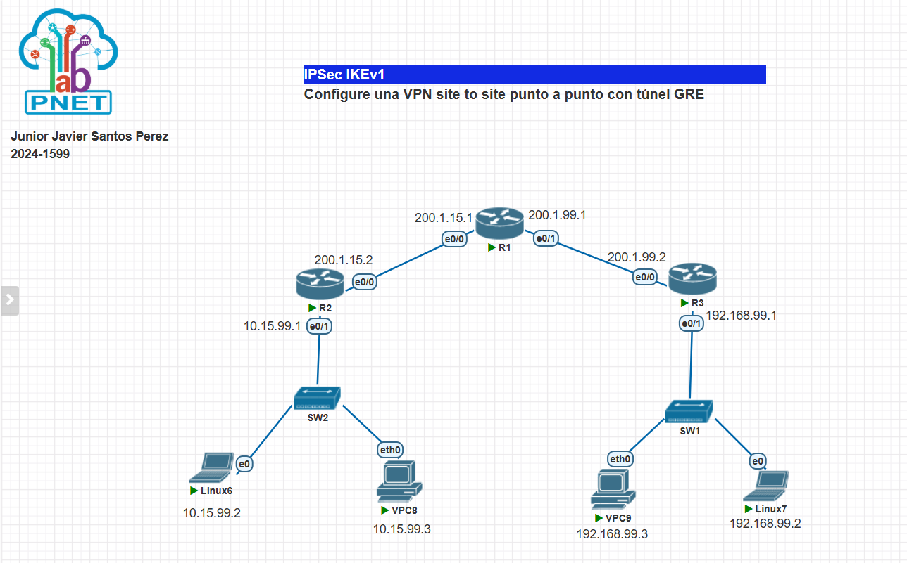
*IMAGEN1 — Topología general del escenario: R1 actúa como ISP/tránsito; R2 es el router VPN del Sitio A y R3 del Sitio B. Cada sitio tiene un switch (SW2/SW1) conectando una máquina Linux y un VPC a su LAN local.*

### 2.1 Direccionamiento IP

| Dispositivo | Interfaz       | Dirección IP       | Descripción                        |
|-------------|----------------|--------------------|------------------------------------|
| R1 (ISP)    | e0/0           | 200.1.15.1/24      | Enlace hacia R2                    |
| R1 (ISP)    | e0/1           | 200.1.99.1/24      | Enlace hacia R3                    |
| R2          | e0/0 (WAN)     | 200.1.15.2/24      | Enlace hacia R1 / Internet         |
| R2          | e0/1 (LAN)     | 10.15.99.1/24      | Red local Sitio A                  |
| R2          | Tunnel0        | 172.16.1.1/30      | Interfaz virtual del túnel GRE     |
| R3          | e0/0 (WAN)     | 200.1.99.2/24      | Enlace hacia R1 / Internet         |
| R3          | e0/1 (LAN)     | 192.168.99.1/24    | Red local Sitio B                  |
| R3          | Tunnel0        | 172.16.1.2/30      | Interfaz virtual del túnel GRE     |
| Linux6      | e0             | 10.15.99.2/24      | Host final Sitio A                 |
| VPC8        | eth0           | 10.15.99.3/24      | Host final Sitio A                 |
| VPC9        | eth0           | 192.168.99.3/24    | Host final Sitio B                 |
| Linux7      | e0             | 192.168.99.2/24    | Host final Sitio B                 |

No se utilizaron VLANs en este escenario; cada switch maneja una única red plana por sitio.

### 2.2 Roles de cada dispositivo

- **R1:** simula el proveedor de Internet. Solo enruta paquetes IP entre las dos WAN públicas sin conocimiento del túnel GRE/IPSec.
- **R2:** router VPN del Sitio A. Origina el túnel GRE `Tunnel0` hacia R3 y protege su tráfico con IPSec IKEv1.
- **R3:** router VPN del Sitio B. Termina el túnel GRE y responde a la negociación IPSec iniciada por R2.

---

## 3. Paso 1 — Configuración de Interfaces y Ruta por Defecto

Cada router VPN recibe su dirección IP en la interfaz WAN (hacia R1) y en la interfaz LAN (hacia su switch local). Además, se configura una ruta por defecto que envía todo el tráfico desconocido hacia R1 (el ISP).

**R1 (ISP):**
```
interface e0/0
 ip address 200.1.15.1 255.255.255.0
 no shutdown
interface e0/1
 ip address 200.1.99.1 255.255.255.0
 no shutdown
```

**R2:**
```
interface e0/0
 ip address 200.1.15.2 255.255.255.0
 no shutdown
interface e0/1
 ip address 10.15.99.1 255.255.255.0
 no shutdown
ip route 0.0.0.0 0.0.0.0 200.1.15.1
```

**R3:**
```
interface e0/0
 ip address 200.1.99.2 255.255.255.0
 no shutdown
interface e0/1
 ip address 192.168.99.1 255.255.255.0
 no shutdown
ip route 0.0.0.0 0.0.0.0 200.1.99.1
```

---

## 4. Paso 2 — IKEv1 Fase 1 (Política ISAKMP)

La Fase 1 de IKEv1 negocia el canal seguro de control (SA ISAKMP) entre los dos peers. Se define una política con los parámetros criptográficos y la llave precompartida para autenticar al peer remoto.

### Parámetros de la política ISAKMP

| Parámetro         | Valor       |
|-------------------|-------------|
| Número de política| 10          |
| Cifrado           | AES         |
| Hash / Integridad | SHA         |
| Autenticación     | Pre-share   |
| Grupo DH          | 2           |
| Lifetime          | 86400 seg   |
| Llave PSK         | cisco       |

```
! R2
crypto isakmp policy 10
 encr aes
 hash sha
 authentication pre-share
 group 2
 lifetime 86400
crypto isakmp key cisco address 200.1.99.2

! R3
crypto isakmp policy 10
 encr aes
 hash sha
 authentication pre-share
 group 2
 lifetime 86400
crypto isakmp key cisco address 200.1.15.2
```

---

## 5. Paso 3 — IPSec Fase 2 (Transform-Set en Modo Transporte)

La Fase 2 define cómo se cifra el tráfico real (el túnel GRE). Se usa el **modo transporte** porque GRE ya añade su propio encabezado de encapsulación; IPSec solo necesita cifrar el payload GRE, sin duplicar el encabezado IP externo.

```
! R2 y R3 (idéntico en ambos)
crypto ipsec transform-set GRE-SET esp-aes esp-sha-hmac
 mode transport
```

### Parámetros del Transform-Set

| Parámetro         | Valor          |
|-------------------|----------------|
| Nombre            | GRE-SET        |
| Protocolo ESP     | esp-aes        |
| Integridad ESP    | esp-sha-hmac   |
| Modo              | Transporte     |

---

## 6. Paso 4 — Interfaz Túnel GRE

Se crea la interfaz virtual `Tunnel0` que encapsula el tráfico entre los dos sitios. El perfil IPSec se aplica directamente sobre el túnel para cifrarlo.

```
! R2
interface Tunnel0
 ip address 172.16.1.1 255.255.255.252
 tunnel source 200.1.15.2
 tunnel destination 200.1.99.2
 tunnel mode gre ip
 tunnel protection ipsec profile GRE-PROFILE

! R3
interface Tunnel0
 ip address 172.16.1.2 255.255.255.252
 tunnel source 200.1.99.2
 tunnel destination 200.1.15.2
 tunnel mode gre ip
 tunnel protection ipsec profile GRE-PROFILE
```

---

## 7. Paso 5 — Perfil IPSec (vincula el Transform-Set al Túnel)

El perfil IPSec es el objeto que enlaza el transform-set con la interfaz de túnel, indicándole a IOS qué parámetros criptográficos usar para proteger el tráfico GRE.

```
! R2 y R3 (idéntico en ambos)
crypto ipsec profile GRE-PROFILE
 set transform-set GRE-SET
```

---

## 8. Paso 6 — Rutas Estáticas por el Túnel GRE

Finalmente se agregan rutas estáticas que dirigen el tráfico hacia la LAN remota a través de la interfaz `Tunnel0`. Esto es lo que convierte la solución en una VPN *route-based*: el reenvío se controla mediante la tabla de enrutamiento.

```
! R2 — ruta hacia la LAN de R3
ip route 192.168.99.0 255.255.255.0 Tunnel0

! R3 — ruta hacia la LAN de R2
ip route 10.15.99.0 255.255.255.0 Tunnel0
```

---

## 9. Verificación — R2

### 9.1 Tabla de enrutamiento de R2

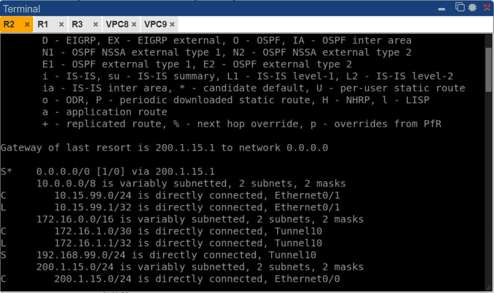
*IMAGEN2 — Salida de `show ip route` en R2: se observa la ruta por defecto (`S*`) hacia 200.1.15.1, la red LAN local 10.15.99.0/24 conectada directamente a e0/1, el túnel 172.16.1.0/30 directamente conectado a `Tunnel0`, y la ruta estática `S` hacia 192.168.99.0/24 apuntando a `Tunnel0`, lo que confirma que el tráfico hacia el Sitio B saldrá cifrado por el túnel GRE/IPSec.*

### 9.2 Configuración crypto de R2

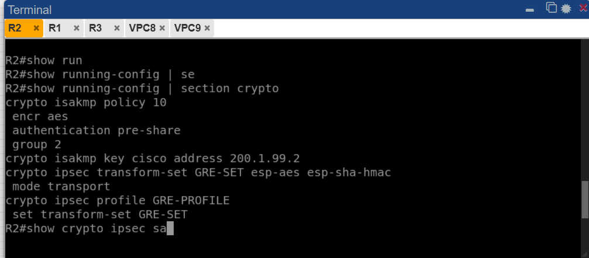
*IMAGEN6 — Salida de `show running-config | section crypto` en R2: se aprecia la política ISAKMP (#10) con cifrado AES, autenticación pre-share y grupo 2; la llave precompartida `cisco` asociada a la dirección 200.1.99.2 (R3); el transform-set `GRE-SET` en modo transporte con esp-aes y esp-sha-hmac; y el perfil IPSec `GRE-PROFILE` vinculando el transform-set al túnel.*

### 9.3 Estado de la SA ISAKMP en R2

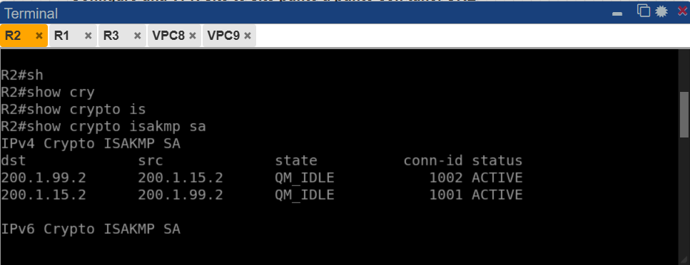
*IMAGEN3 — Salida de `show crypto isakmp sa` en R2: se muestran dos entradas para el par 200.1.15.2 ↔ 200.1.99.2, ambas en estado `QM_IDLE` (Quick Mode Idle) con status `ACTIVE`, lo que indica que la Fase 1 de IKEv1 se negoció correctamente y el canal ISAKMP está establecido y activo.*

### 9.4 Estado de la SA IPSec en R2

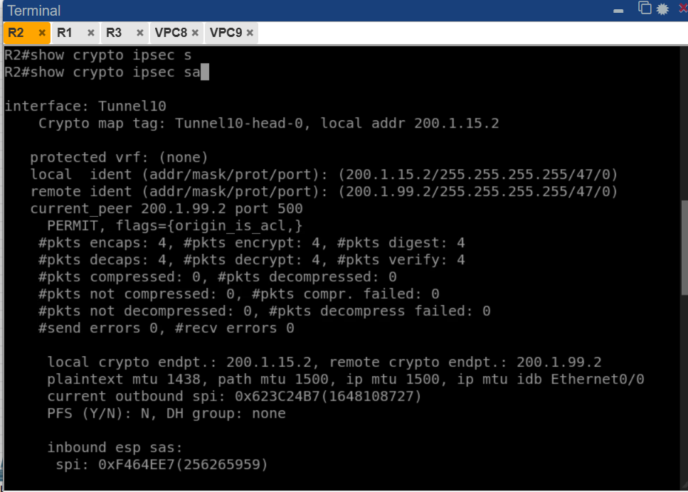
*IMAGEN4 — Salida de `show crypto ipsec sa` en R2: el túnel activo es `Tunnel0` con el crypto map `Tunnel0-head-0`. La identidad local es `200.1.15.2/255.255.255.255/47/0` y la remota `200.1.99.2/255.255.255.255/47/0` (protocolo 47 = GRE), confirmando que IPSec está protegiendo específicamente el tráfico GRE. Se registran 4 paquetes encapsulados/cifrados y 4 desencapsulados/descifrados sin errores.*

### 9.5 Estado de la sesión crypto en R2

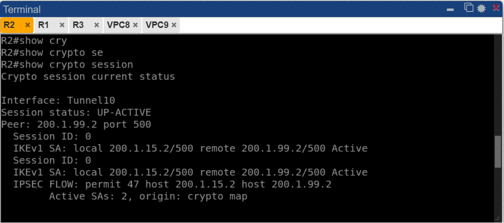
*IMAGEN5 — Salida de `show crypto session` en R2: la interfaz `Tunnel0` presenta estado de sesión `UP-ACTIVE` hacia el peer 200.1.99.2. Se muestran dos SAs IKEv1 activas (inbound y outbound) y el flujo IPSec protege el protocolo 47 (GRE) entre los hosts 200.1.15.2 y 200.1.99.2, con 2 SAs activas de origen `crypto map`.*

---

## 10. Verificación — R3

### 10.1 Tabla de enrutamiento de R3

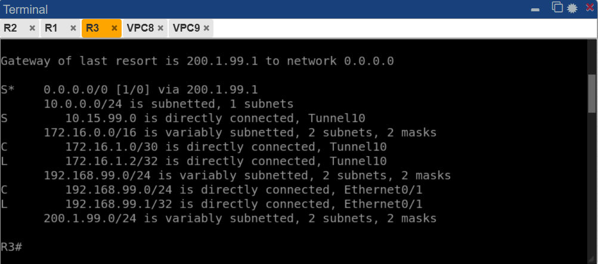
*IMAGEN7 — Salida de `show ip route` en R3: ruta por defecto hacia 200.1.99.1, red LAN 192.168.99.0/24 conectada directamente a e0/1, túnel 172.16.1.0/30 conectado a `Tunnel0`, y la ruta estática `S` hacia 10.15.99.0/24 apuntando a `Tunnel0`, confirmando el enrutamiento simétrico al de R2 y que el tráfico hacia el Sitio A sale por el túnel GRE/IPSec.*

### 10.2 Estado de la SA ISAKMP en R3

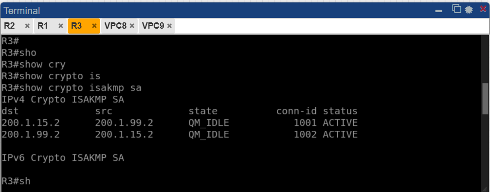
*IMAGEN8 — Salida de `show crypto isakmp sa` en R3: par 200.1.99.2 ↔ 200.1.15.2 con dos entradas en estado `QM_IDLE` y status `ACTIVE`, confirmando que la Fase 1 de IKEv1 está correctamente establecida también desde la perspectiva de R3.*

### 10.3 Estado de la SA IPSec en R3

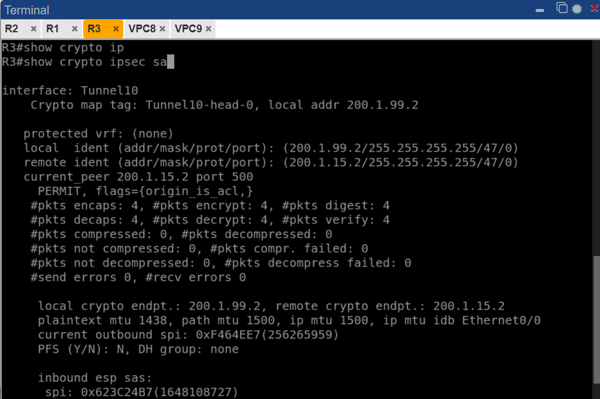
*IMAGEN9 — Salida de `show crypto ipsec sa` en R3: el túnel activo es `Tunnel0` desde el extremo 200.1.99.2. Se confirman las identidades locales y remotas con protocolo 47 (GRE), 4 paquetes encapsulados/cifrados y 4 desencapsulados/descifrados sin errores, valores simétricos a los de R2, validando que el flujo bidireccional funciona correctamente.*

### 10.4 Estado de la sesión crypto en R3

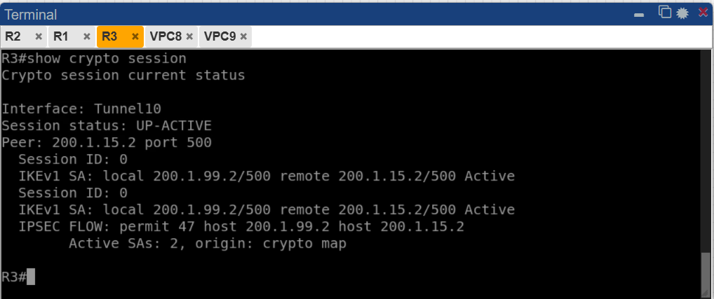
*IMAGEN10 — Salida de `show crypto session` en R3: la interfaz `Tunnel0` muestra estado `UP-ACTIVE` hacia el peer 200.1.15.2, con dos SAs IKEv1 activas y el flujo IPSec protegiendo el protocolo 47 entre 200.1.99.2 y 200.1.15.2. Confirma la bidireccionalidad del túnel GRE/IPSec desde el Sitio B.*

---

## 11. Pruebas de Conectividad End-to-End

Se realizaron pruebas de ping cruzadas entre los hosts finales de cada sitio para validar que el túnel GRE protegido por IPSec permite el tráfico entre las LANs.

### 11.1 Ping desde VPC8 (Sitio A) hacia VPC9 (Sitio B)

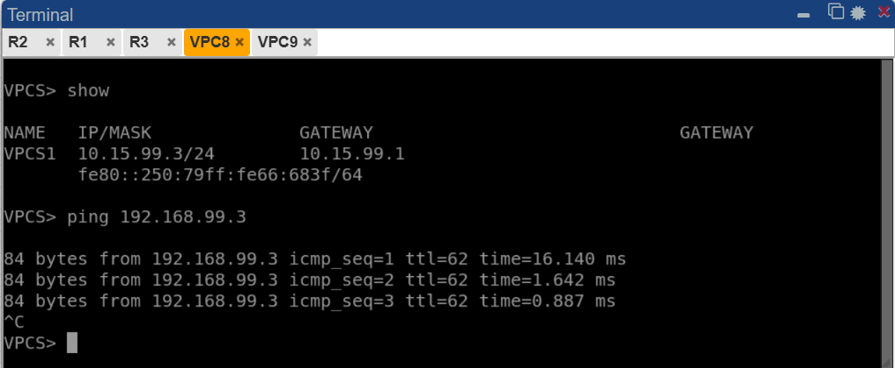
*IMAGEN11 — Desde VPC8 (10.15.99.3/24, gateway 10.15.99.1) se ejecuta ping hacia 192.168.99.3 (VPC9, Sitio B). Las respuestas exitosas con 0% de pérdida confirman que el tráfico atraviesa el túnel `Tunnel0` cifrado con GRE/IPSec entre R2 y R3 y llega correctamente a la LAN remota del Sitio B.*

### 11.2 Ping desde VPC9 (Sitio B) hacia VPC8 (Sitio A)

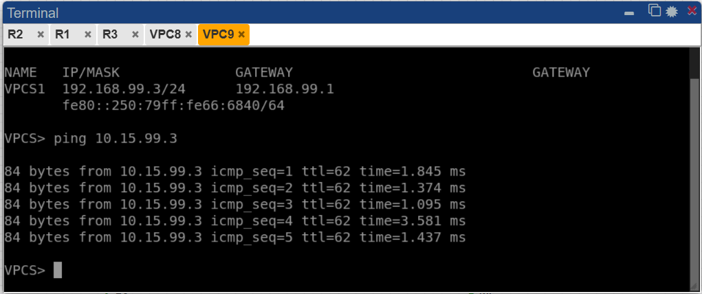
*IMAGEN12 — Desde VPC9 (192.168.99.3/24, gateway 192.168.99.1) se ejecuta ping hacia 10.15.99.3 (VPC8, Sitio A). Las 5 respuestas exitosas con 0% de pérdida confirman la bidireccionalidad del túnel GRE/IPSec y que el enrutamiento estático hacia `Tunnel0` funciona correctamente en ambos routers.*

---

## 12. Resumen de Parámetros Utilizados

| Parámetro                   | Valor                      |
|-----------------------------|----------------------------|
| Protocolo de intercambio    | IKEv1 (ISAKMP)             |
| Fase 1 — Cifrado            | AES                        |
| Fase 1 — Integridad (Hash)  | SHA                        |
| Fase 1 — Autenticación      | Pre-Shared Key (`cisco`)   |
| Fase 1 — Grupo DH           | Grupo 2                    |
| Fase 1 — Lifetime           | 86400 segundos             |
| Fase 2 — Protocolo ESP      | esp-aes                    |
| Fase 2 — Integridad ESP     | esp-sha-hmac               |
| Fase 2 — Modo IPSec         | Transporte                 |
| Tipo de túnel               | GRE (`tunnel mode gre ip`) |
| Interfaz de túnel           | Tunnel0                    |
| Red del túnel GRE           | 172.16.1.0/30              |
| Protocolo protegido por SA  | 47 (GRE)                   |

---

## 13. Diferencias Clave respecto a IKEv2 Route-Based

| Aspecto                    | IKEv1 + GRE (esta práctica)         | IKEv2 Route-Based (práctica anterior)  |
|----------------------------|--------------------------------------|-----------------------------------------|
| Protocolo de intercambio   | IKEv1 / ISAKMP                      | IKEv2                                   |
| Tipo de túnel              | GRE + IPSec modo transporte          | IPSec modo túnel (sin GRE)              |
| Interfaz de túnel          | `tunnel mode gre ip`                 | `tunnel mode ipsec ipv4`                |
| Identidad SA (protocolo)   | Protocolo 47 (GRE)                   | 0.0.0.0/0 (todo el tráfico)            |
| Configuración Fase 1       | `crypto isakmp policy`               | `crypto ikev2 proposal` + `policy`      |
| Autenticación / Keyring    | `crypto isakmp key`                  | `crypto ikev2 keyring`                  |
| Perfil requerido           | Solo perfil IPSec                    | Perfil IKEv2 + perfil IPSec             |

---

## 14. Conclusión

Se configuró exitosamente una VPN Site-to-Site con túnel GRE protegido por IPSec IKEv1 entre los routers R2 y R3. La Fase 1 ISAKMP quedó en estado `QM_IDLE / ACTIVE` en ambos extremos, la Fase 2 IPSec registró tráfico GRE (protocolo 47) cifrado y descifrado sin errores, y las sesiones crypto mostraron estado `UP-ACTIVE`. Las pruebas de ping entre VPC8 y VPC9 validaron la conectividad end-to-end cifrada entre las LANs de ambos sitios, comprobando que el enrutamiento estático a través de `Tunnel0` y la protección GRE/IPSec funcionan correctamente en ambas direcciones.
